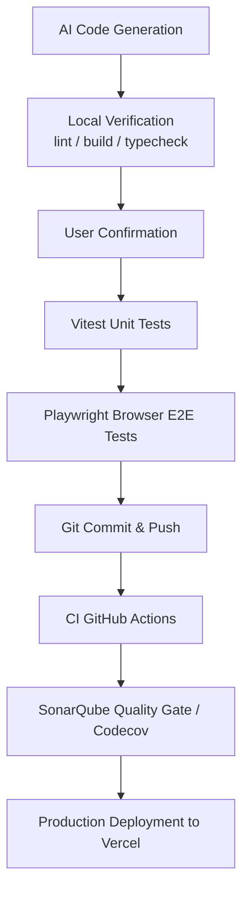

# SvelteKit: 多人(家庭)共享線上記帳本 | 包含人工智慧輔助工程流程的完整入門套件

[](https://codecov.io/gh/john-data-chen/sveltekit-starter-kit)
[](https://sonarcloud.io/summary/new_code?id=john-data-chen_sveltekit-starter-kit)
[](https://github.com/john-data-chen/sveltekit-starter-kit/actions/workflows/ci.yml)
[](https://opensource.org/licenses/MIT)

這是一個產品級別的 SvelteKit starter kit，以真實可用的多使用者 **線上記帳本** 為核心，所有帳號都可以新增支出、收入，並查看統計資訊。而管理帳號可以看到所有帳號的交易紀錄。
這展示技術決策、品質工程，以及 AI 輔助開發的實作方式。技術棧包含 Svelte 5（runes mode）、TypeScript、Tailwind CSS v4、Prisma ORM 與 PostgreSQL。

本專案刻意聚焦於產品團隊在意的能力：型別化、模組化的 **TypeScript / Node.js**；有意識的 **API、資料流與 RBAC** 設計；搭配 ORM 驅動 **schema migration** 與執行時驗證的 **PostgreSQL**；**AI 輔助（Harness）工程**；以及具紀律、可驗證的交付。

英文版本請見 **[README.md](./README.md)**。

**[Live Demo](https://sveltekit-starter-kit.vercel.app/login)** — 按下 **以 Email 繼續** 即可用已建立的使用者登入。

<table>
  <tr>
    <td align="center"></td>
    <td align="center"></td>
    <td align="center"></td>
    <td align="center"></td>
    <td align="center"></td>
    <td align="center"></td>
  </tr>
  <tr>
    <td align="center"><b>登入畫面</b></td>
    <td align="center"><b>儀表板</b></td>
    <td align="center"><b>交易紀錄清單</b></td>
    <td align="center"><b>新增交易</b></td>
    <td align="center"><b>管理員介面</b></td>
    <td align="center"><b>API 文件</b></td>
  </tr>
</table>

---

| 指標           | 結果                                                                                       |
| -------------- | ------------------------------------------------------------------------------------------ |
| Test Coverage  | 見上方 **codecov** badge，95+% 由 Vitest（unit + integration）量測                         |
| Code Quality   | 見上方 **SonarQube Quality Gate** badge（Security、Reliability、Maintainability，全 A 級） |
| Lighthouse     | Production 環境儀表板 Lighthouse 評分 — **全 90+ 分）**                                    |
| E2E Validation | Playwright 跨瀏覽器驗證(Chrome / Safari / Edge / Mobile Chrome / Mobile Safari)            |
| CI/CD Pipeline | Gemini PR Review + GitHub Actions → SonarQube + Codecov → Vercel（自動部署到 Production）  |

---

## 生產環境 Lighthouse 儀表板審查


---

## 技術決策

### 架構

評估過引入第三方 UI 元件庫，最終選擇建立內部的 Svelte 5 primitives 層 — 理由：維持極少依賴的原則、無依賴成本的抽象化、符合無障礙標準（a11y-correct）的原生 `<dialog>`，以及利用 Svelte 5 snippets 達到純 HTML 屬性傳遞（不需透過 bind prop-drilling）。

| 類型          | 選擇                                           | 理由                                                                                  |
| ------------- | ---------------------------------------------- | ------------------------------------------------------------------------------------- |
| Framework     | SvelteKit 2 + Svelte 5（runes）                | 精細的響應性、極簡樣板、SSR + 表單操作                                                |
| Styling       | Tailwind CSS v4（Vite plugin）                 | 公用優先、零執行時間，透過 v4 Vite plugin 加速建置                                    |
| Database      | Prisma ORM + PostgreSQL                        | 宣告式 schema 作為唯一真相來源；型別安全的 generated client、內建 migrations          |
| DB Driver     | `pg`（經 `@prisma/adapter-pg`）                | Prisma v7 driver-adapter 工作流；快速 pooled driver，適合 Vercel Node serverless 服務 |
| Auth          | Password-less email + signed `httpOnly` cookie | 不儲存密碼；使用最小且清楚的 session model                                            |
| Authz/RBAC    | 路由層級的權限守衛（`requireAdmin`）           | 基於資料庫使用者角色（`admin` 與 `member`）的嚴格存取控制                             |
| Rate Limiting | 記憶體內的 fixed-window 限流（登入 + API）     | 簡易的防暴力破解/濫用；生產環境會改用 Vercel KV / Redis                               |
| Security      | Nonce CSP + HSTS + 強化的回應標頭              | 縱深防禦；僅 Scalar `/api/docs` 放寬 CSP，dev 模式移除 CSP 以支援 Vite HMR            |
| Validation    | Zod（server-side schemas）                     | 在 form action 邊界做執行時驗證 — 編譯檢查交給 TS，輸入檢查交給 Zod                   |
| REST API      | 完整的 CRUD API + JSON 回應封裝                | 分離的 REST 層以利外部系統整合或手機端應用呼叫                                        |
| API Docs      | Scalar UI + Zod 4 原生 OpenAPI 匯出            | 直接由 Zod 模型動態產生的零阻力互動式 API 文件                                        |
| Tables        | `@tanstack/table-core`                         | Headless，無 UI 依賴，將排序狀態同步至 URL 並且純粹使用 Svelte 元件渲染               |
| Charts        | Pure CSS donut                                 | 不引入圖表套件，減少打包體積並保留完整控制                                            |
| i18n          | Paraglide JS（`@inlang/paraglide-js`）         | 類型安全、tree-shakeable 翻譯；支援英文與繁體中文                                     |
| Deploy        | `@sveltejs/adapter-vercel`（Node serverless）  | `pg` TCP driver 需要 Node runtime                                                     |

### 品質保證

| 類型              | 工具       | 理由                                             |
| ----------------- | ---------- | ------------------------------------------------ |
| Unit/Integration  | Vitest     | 比 Jest 更快，原生 ESM，與 Vite 生態整合佳       |
| E2E               | Playwright | 跨瀏覽器支援，比 Cypress 更輕量                  |
| Static Analysis   | SonarQube  | 在 CI 中執行 quality gates 程式碼 bad smell 檢查 |
| Coverage Tracking | Codecov    | 自動整合 PR coverage                             |

**Testing Strategy:**

- Unit tests 聚焦查詢邏輯、驗證、貨幣 格式化 / 解析
- E2E tests 驗證重要流程（登入、transaction CRUD）
- 每次推送/PR 都會先運行整個 pipeline，由 Gemini 進行初審，然後開發者再複查。只有兩次審核都通過後才會合併（免費伺服器效能不足，因此 CI 只執行單元測試，端對端測試在本機上執行）。

### Developer Experience

| 工具                    | 用途                                                     |
| ----------------------- | -------------------------------------------------------- |
| oxlint                  | Rust-based JS/TS linter，比 ESLint 快 50-100 倍          |
| oxfmt                   | Rust-based formatter，處理 JS/TS/CSS/HTML/JSON/MD/Svelte |
| ESLint（Svelte）        | 專門處理 `.svelte` 檔案的 lint（啟用 content-hash 快取） |
| Vite                    | 近乎即時的 HMR 與快速建置                                |
| Husky + lint-staged     | pre-commit 品質檢查                                      |
| commitlint + Commitizen | Conventional commits，維持乾淨 commit history            |

### 架構決策紀錄 (ADR)

| 決策                                                         | 原因                                                                                                                                                                                                                                                                                                             |
| ------------------------------------------------------------ | ---------------------------------------------------------------------------------------------------------------------------------------------------------------------------------------------------------------------------------------------------------------------------------------------------------------- |
| 保留 `svelte.config.js`，不將所有設定整合到 `vite.config.ts` | SvelteKit ≥ 2.62.0 可使用 `sveltekit()` 將 `svelte.config.js` 內容整合到 `vite.config.ts`，但 `svelte-check`、`eslint-plugin-svelte` 與 IDE (VS Code..etc) 仍需讀取 `svelte.config.js` 取得強制 runes 設定。新做法必須放棄原先默認的設定，推翻慣例也許會讓其他接手的開發者感到疑惑，權衡利弊後決定使用原先做法。 |
| 自建 Svelte 5 UI primitives，不用元件庫                      | 更少依賴、更小 bundle、原生 a11y（`<dialog>`/`<select>`）、乾淨的 runes/snippets                                                                                                                                                                                                                                 |
| Vercel Node 用 pooled `pg` TCP driver（非 Edge）             | 可靠連線池、免 proxy、本機 Docker 跑相同 Postgres                                                                                                                                                                                                                                                                |
| Zod schema = 單一真相來源                                    | 一份 schema → 驗證 + TS 型別 + OpenAPI 3.1；零落差                                                                                                                                                                                                                                                               |

---

## 功能

- **Password-less email login** — 內建三個帳號（`john@example.com` (Admin)、`sophia@example.com` (Member)、`mark@example.com` (Member)）；表單預填 `john@example.com`，按一次即可登入。`userId` 會存放在 signed `httpOnly` session cookie。
- **角色與權限 (Roles & Permissions)** — "member"（預設）只能看見並操作自己的記帳資料；"admin" 則可存取 `/admin` 管理介面，總覽所有使用者的平台使用狀況（Governance）。
- **稽核日誌 (Audit Log)** — 紀錄使用者變更（新增、修改、刪除），顯示於管理員 Governance 介面中。
- **Transactions CRUD** — 可新增、查看、編輯、刪除收入/支出紀錄（數目、類型、類別、日期、備註）。
- **Sortable data-tables (TanStack)** — 交易清單與管理員報表皆採用 TanStack Table 實作排序功能，並且排序狀態會與 URL 同步。
- **List & filter** — 可依 類型 與 月份 篩選交易紀錄；查詢條件會保存在 URL。
- **Dashboard** — 顯示當月收入、支出、結餘，以及以 原生CSS 製作的類型圓環圖 (無依賴圖表庫，支援大/小切換)。
- **REST API + OpenAPI 互動文件** — 提供完整的 CRUD endpoints (`/api/transactions`, `/api/stats`)，重度利用 Zod 模型來動態對應出即時的 OpenAPI 3.1 規範。同時於 `/api/docs` 掛載了 Scalar UI 以供互動式探索。
- **Per-user data isolation** — 每個查詢都會以登入使用者做限制；使用者只能看到自己的資料。
- **Schema migration 與驗證** — PostgreSQL schema 以 Prisma Migrate 做版本控管（`db:migrate`），所有不可信輸入都在邊界經由 Zod 驗證；單一 schema 同時是型別、驗證與 OpenAPI 規範的唯一真相來源。
- **限流 (Rate limiting)** — best-effort 記憶體內 fixed-window 限流：登入每 IP 每分鐘上限 10 次，已驗證的 API 寫入每 IP 每分鐘上限 100 次，超過時回傳 `429` 並附上 `Retry-After` header。（serverless 環境下應改用 Vercel KV / Upstash Redis 讓多實例共享狀態。）
- **安全強化 (Security hardening)** — 每個 HTML 回應都帶有 nonce-based Content-Security-Policy，以及 `X-Content-Type-Options`、`X-Frame-Options: DENY`、`Referrer-Policy`、`Permissions-Policy`；production 另啟用 `Strict-Transport-Security`。僅 Scalar `/api/docs` 頁面放寬 CSP，dev 模式則移除 CSP 以支援 Vite HMR。
- **API 分頁 (Pagination)** — `GET /api/transactions` 接受 `limit`（預設 20，上限 100）與 `offset`，並回傳 `{ data, pagination: { total, limit, offset } }` 封裝。
- **Currency** — 僅支援 TWD，金額以整數儲存，不使用小數。
- **i18n** — 英文與繁體中文（Paraglide JS）。
- **Theme switching** — 淺色 / 深色 / 系統。
- **Responsive design** — 手機小螢幕排版優先，也支援電腦大螢幕排版。
- **Web analytics** — 全站注入 Vercel Web Analytics（`@vercel/analytics`），提供注重隱私、不使用 cookie 的流量洞察。
- **SEO 與可被搜尋性** — 登入著陸頁提供在地化的 meta description（`seo_description`）、canonical URL、theme-color、Open Graph 與 Twitter Card 標籤，以及 JSON-LD `WebApplication` 結構化資料；並從 `static/` 提供 `sitemap.xml` 與 `robots.txt` 的 `Sitemap:` 指令。

Category 固定定義於 `src/lib/categories.ts`；session cookie 使用 `.env` 中的 `SESSION_SECRET` 簽章。

---

## 角色與權限 (Roles & Permissions) / Governance

應用程式強制執行基於資料庫角色的資料權限邊界。這正是企業系統（ERP / BPM / 內部後台工具）所仰賴的存取控制與監督樣式：role-based access control、逐使用者資料隔離、稽核軌跡（audit trail），以及僅供讀取的治理／合規檢視。

- **成員 (Member)**：只能存取自己的儀表板與交易紀錄。資料在查詢層級即做到單一使用者隔離。
- **管理員 (Admin)**：視為受信任的合規/治理稽核員。受到伺服器端 `requireAdmin` 守衛保護的 `/admin` 總覽介面僅供讀取。為了方便平台監督，設計上允許管理員在稽核日誌 (Audit Trail) 中看見單筆紀錄細節（例如單筆交易金額與分類）。

管理員 Governance 介面彙整逐使用者活動（交易筆數、所有成員的總收入／支出），並搭配新增／修改／刪除事件的稽核軌跡 — 這正是企業後台工具（ERP／BPM／內部系統）所需的跨使用者監督與合規可視性。

---

## REST API 與 OpenAPI 文件

**[Live API 文件 →](https://sveltekit-starter-kit.vercel.app/api/docs)** — 互動式 OpenAPI 3.1 參考文件（Scalar UI）。

獨立的 REST 層（`/api/transactions`、`/api/stats`）提供完整 CRUD，含 cookie-based 驗證、逐使用者資料隔離、分頁與 `429` 限流 — 這正是前端、行動端或外部系統整合會串接的 API／資料流／權限邊界。每個 endpoint 的請求／回應形狀都以單一 **Zod schema** 定義（唯一真相來源），同時驅動執行時驗證與 `/api/openapi.json` 的即時 OpenAPI 3.1 規範，並透過 `/api/docs` 的 Scalar 呈現。文件由 schema 產生，因此永遠不會與實作脫節。

---

## 駕馭工程 (Harness Engineering)

這個專案採用 Human-in-the-Loop 的 AI 協作方式。AI 工具不只是產生程式碼，而是被用來提高 **架構槓桿、品質保證與開發速度**。

AI agent 是受治理的協作開發者，而非可自行 commit 的自動程式。

- **Human-in-the-loop** — 每個指令與變更都經審查；不自行執行。
- **Prompt 與 task template** — 每個 session 先定好角色、可動範圍與通過標準（lint／build／check／tests）。
- **Context 管理** — 範圍限縮在 `src/`；可重用的已提交 skills；離線參考文件。
- **Skill 與 task 拆解** — 唯讀規劃 → 人工審查 → 單步執行 → 逐步驗證。
- **生成邊界控制** — Zod 強制 I/O contract；測試 mock PostgreSQL／第三方；HSTS／CSP 依 `dev` 與 prod 切換。
- **Session handoff** — task 與 session log 讓任何模型從中斷處包含但不限於 token 或 session 耗盡 / 不可預期的崩潰 接手。
- **交付紀律** — 每次變更都明確掌握需求、風險與影響範圍，並須通過上線前驗證（lint／build／check／tests）才能合併。

### 可衡量的影響

透過將 AI 整合到技術堆疊中，本專案實現了以下目標：

- **速度**：樣板程式碼和標準模式的實現速度提升 5-10 倍，借助 Gemini Code Assist 將 PR 審查時間縮短 30-40%。
- **品質**：透過 AI 產生的測試框架，實現更高的測試覆蓋率（80% 以上）。以及 Gemini Code Assist 的 PR 審查，從而減少 bug 和程式碼異味。
- **學習**：透過 AI 指導的實現，快速掌握新工具（Svelte、Sveltekit、Prisma 等）。
- **成本**：利用 AI 代理的技能減少程式碼迭代次數並遵循最佳實踐，從而降低成本。
- **專注**：將工程時間從語法開發轉移到系統架構和使用者體驗。

### AI Agent Skills（`.agents/skills/`）

Skills 會提交到 repo，並透過 `AGENTS.md` / `CLAUDE.md` 提供給 AI assistants。每個 skill 都封裝了特定工作流與專案慣例。

| Skill                                                                                                                                 | 職責                                                                                        |
| ------------------------------------------------------------------------------------------------------------------------------------- | ------------------------------------------------------------------------------------------- |
| [karpathy-guidelines](https://github.com/forrestchang/andrej-karpathy-skills)                                                         | 降低 LLM 程式碼錯誤：明確假設、優先簡單方案、手術刀式修改、目標導向循環                     |
| [doc-coauthoring](https://github.com/anthropics/skills/tree/main/skills/doc-coauthoring)                                              | 文件共筆的 3 階段工作流程（上下文 → 精煉 → 讀者測試），本 README 由此技能與作者共同協作產生 |
| **session-handoff (my private skill)**                                                                                                | 維護 `ai-docs/tasks.md` + `ai-docs/session-log.md`，讓跨模型/跨 session 接手時沒有資訊斷層  |
| [prisma official AI guide](https://www.prisma.io/docs/ai)（cli、client-api、database-setup、postgres、driver-adapter-implementation） | Prisma ORM 工作流：CLI 指令、client API、provider 設定、Prisma Postgres、driver adapters    |
| [svelte-code-writer](https://svelte.dev/docs/ai/skills)                                                                               | 用於在建立/編輯任何 `.svelte` 檔案時尋找技術文件和進行程式碼分析的 CLI 工具                 |
| [svelte-core-bestpractices](https://svelte.dev/docs/ai/skills)                                                                        | 編寫快速、健壯、現代的 Svelte 程式碼的指南。                                                |

### MCP（Model Context Protocol）Servers

MCP 讓 AI 工具可直接和開發基礎設施互動，從而消除上下文切換 (人工介入) 的 token 開銷。

| Server                                                                       | Integration Point | Workflow Enhancement                                                              |
| ---------------------------------------------------------------------------- | ----------------- | --------------------------------------------------------------------------------- |
| [svelte-mcp](https://svelte.dev/docs/ai/mcp)                                 | Svelte docs       | 官方 Svelte 5 / SvelteKit docs、examples、code autofixing（已提交於 `.mcp.json`） |
| [context7](https://github.com/upstash/context7)                              | Documentation     | 提供 AI agents version-accurate 的即時 library docs                               |
| [chrome-devtools-mcp](https://github.com/ChromeDevTools/chrome-devtools-mcp) | Browser state     | 讓 AI agents 透過 DevTools Protocol 檢查與驗證正在執行的 app                      |

### AI Guidelines（`AGENTS.md` / `CLAUDE.md`）

這些檔案是 AI 輔助開發的專案工作守則，包含主要驗證流程（`pnpm lint` → `pnpm build` → `pnpm check`）、常用指令，以及不同任務應使用的 skills/MCP servers。AI 在修改此專案前應先讀取這些指引。

人機協作開發流程：



---

## Quick Start

### Requirements

- Node.js >= 24
- pnpm 11.5+
- Docker / OrbStack（本機 PostgreSQL）

### Setup

```bash
pnpm install

# Environment — set DATABASE_URL + SESSION_SECRET
cp .env.example .env

# Database
pnpm db:start          # Start PostgreSQL via Docker (compose.yaml)
pnpm db:migrate        # Apply migrations to the local DB
pnpm db:seed           # Seed 3 demo users + sample transactions

# Run
pnpm dev               # Development server
pnpm test              # Unit tests
pnpm test:e2e          # E2E tests (needs a seeded DB + dev server)
pnpm build             # Production build
```

`.env.example` 的預設 `DATABASE_URL` 與 `compose.yaml` 相符。請將 `SESSION_SECRET` 設成一段足夠長的隨機字串 (如使用指令 `openssl rand -base64 32` 產生)，用來簽署 session cookie。接著開啟 dev server（預設 `http://localhost:5173`），按下 **以 Email 繼續** 即可用 `john@example.com` 登入。

### Commands

```bash
pnpm dev           # Start dev server
pnpm build         # TypeScript compile + Vite build
pnpm preview       # Preview production build
pnpm lint          # oxlint --fix (JS/TS) + eslint（Svelte，啟用快取）
pnpm format        # oxfmt --write .
pnpm test          # vitest run
pnpm test:coverage # vitest run --coverage
pnpm test:e2e      # Playwright e2e
pnpm check         # svelte-kit sync + svelte-check
pnpm commit        # git-cz (commitizen with commitlint)
pnpm db:start      # docker compose up (PostgreSQL)
pnpm db:generate   # prisma generate
pnpm db:migrate    # prisma migrate dev
pnpm db:push       # prisma db push
pnpm db:seed       # Seed demo users + sample transactions
```

### 測試架構

- **雙專案模式**: `server`（Node.js，後端工具與 API）與 `client`（JSDOM，Svelte 元件與 runes）。
- **命名規範**:
  - `*.spec.ts`: 於 `server` 環境執行。
  - `*.svelte.spec.ts`: 於 `client`（JSDOM）環境執行。
- **常用指令**:
  - `pnpm test`: 執行所有 Vitest 單元測試。
  - `pnpm test:coverage`: 執行測試覆蓋率（門檻 >=80%）。
  - `pnpm test:e2e`: 執行 Playwright 瀏覽器 E2E 測試。
- **元件測試範例**:
  ```ts
  import { render, screen } from "@testing-library/svelte";
  import Button from "./Button.svelte";
  render(Button, { props: { children: () => "Click" } });
  expect(screen.getByRole("button", { name: "Click" })).toBeTruthy();
  ```

---

## Project Structure

```text
.
├── .agents/skills/              # Repo 專用 AI skills，由 AGENTS.md / CLAUDE.md 使用
│   ├── doc-coauthoring/         # 文件共筆 workflow
│   ├── prisma-*/                # Prisma ORM 慣例（cli、client-api、database-setup、postgres、driver-adapter）
│   ├── karpathy-guidelines/     # Surgical change 與驗證紀律
│   ├── session-handoff/         # (private, 未提交) 維護 ai-docs/tasks.md + session-log.md
│   ├── svelte-code-writer/      # Svelte MCP/CLI 查詢與 autofix workflow
│   └── svelte-core-bestpractices/
├── .codex/                      # Codex AI configuration
├── .github/workflows/ci.yml     # GitHub Actions：install、test、Codecov、SonarQube
├── .husky/                      # Git hooks（pre-commit, commit-msg）
├── .opencode/                   # OpenCode AI configuration
├── .vscode/                     # VS Code settings + extension recommendations
├── ai-docs/                     # AI task template、task plan、session log
├── prisma/                      # Prisma schema + generated SQL migrations
├── e2e/
│   ├── expense.spec.ts          # Playwright login + transaction CRUD happy path
│   └── sort.spec.ts             # Playwright 排序 + URL 狀態 e2e 檢查
├── messages/                    # Paraglide source messages
│   ├── en.json                  # 英文翻譯檔
│   └── zh-tw.json               # 繁體中文翻譯檔
├── src/
│   ├── app.d.ts                 # SvelteKit app types（App.Locals.user）
│   ├── app.html                 # HTML shell，包含 Paraglide lang/dir placeholders
│   ├── hooks.server.ts          # Session lookup、locale middleware、theme class injection
│   ├── lib/
│   │   ├── assets/              # Favicon 與 README screenshots
│   │   ├── components/          # CategoryChart, LocaleSwitcher, ThemeToggle, TransactionForm
│   │   │   └── ui/              # 自建 Svelte 5 primitives：Button、ConfirmDialog、Field
│   │   ├── server/
│   │   │   ├── db/
│   │   │   │   ├── admin.ts     # Admin-only 查詢（跨使用者統計資料）
│   │   │   │   ├── audit.ts     # 稽核日誌查詢
│   │   │   │   ├── index.ts     # 使用 DATABASE_URL 的 Prisma client（pg adapter）
│   │   │   │   ├── queries.ts   # User-scoped CRUD + dashboard aggregates
│   │   │   │   ├── schema.ts    # 由 generated Prisma client 衍生的 app-level 型別
│   │   │   │   ├── schema.spec.ts
│   │   │   │   └── seed.ts      # Demo users 與 transactions
│   │   │   ├── auth.ts          # HMAC-signed httpOnly session cookie
│   │   │   ├── guards.ts        # requireUser protected-route helper
│   │   │   ├── login.ts         # Password-less email lookup
│   │   │   ├── session.ts       # Cookie -> database-backed SessionUser resolver
│   │   │   ├── api.ts           # REST API 回應包裝與身分驗證守衛
│   │   │   ├── rate-limit.ts    # 記憶體內 fixed-window 限流（登入 + API）
│   │   │   ├── openapi.ts       # 動態從 Zod 產生 OpenAPI 3.1 規範
│   │   │   ├── schemas.ts       # 共用的 Zod 定義 (表單與 API 共用)
│   │   │   └── validation.ts    # Action 驗證邏輯，底層依賴 schemas.ts
│   │   ├── table/               # TanStack 排序：與 URL 同步的 sorted-table store
│   │   │   └── sorted-table.svelte.ts
│   │   ├── categories.ts        # 固定 category keys + localized labels
│   │   ├── constants.ts         # App name、demo email、pageTitle helper
│   │   ├── date.ts              # YYYY-MM / YYYY-MM-DD helpers
│   │   ├── index.ts             # lib barrel re-exports
│   │   ├── money.ts             # TWD integer formatting/parsing
│   │   ├── theme.svelte.ts      # Client theme store（light / dark / system）
│   │   ├── theme.ts             # Server-safe theme constants and helpers
│   │   └── transaction.ts       # Transaction form value types
│   ├── routes/
│   │   ├── admin/               # 管理員專用的 Governance 介面，顯示所有使用者的統計摘要
│   │   ├── api/                 # REST endpoints
│   │   │   ├── docs/            # Scalar API 參考文件 UI
│   │   │   ├── openapi.json/    # 動態產生的 OpenAPI 3.1 規範
│   │   │   ├── stats/           # 供儀表板使用的彙總 REST endpoint
│   │   │   └── transactions/    # 用於交易紀錄 CRUD 的 REST endpoints
│   │   ├── login/               # Password-less email sign-in page/action + route spec
│   │   ├── logout/              # Sign-out action
│   │   ├── transactions/
│   │   │   ├── [id]/edit/       # Edit form load/action，含 ownership check
│   │   │   ├── new/             # Create form load/action
│   │   │   └── +page.*          # List/filter page + delete action
│   │   ├── +layout.server.ts    # Auth guard 與所有頁面的 user data
│   │   ├── +layout.svelte       # App shell、nav、locale/theme controls、logout form
│   │   ├── +page.server.ts      # Dashboard monthly stats loader
│   │   ├── +page.svelte         # Dashboard UI 與 pure-CSS category chart
│   │   └── layout.css           # Tailwind v4 import 與 global styles
│   └── *.spec.ts                # 與 source modules colocated 的 unit/integration specs
├── static/
│   ├── robots.txt               # 爬蟲規則 + sitemap 指令
│   └── sitemap.xml              # 供搜尋引擎使用的公開 sitemap
├── .env.example                 # DATABASE_URL + SESSION_SECRET template
├── .mcp.json                    # Svelte MCP server registration
├── .npmrc                       # pnpm/node package manager settings
├── .oxfmtrc.json                # oxfmt formatter config
├── .oxlintrc.json               # oxlint JS/TS lint rules
├── AGENTS.md                    # 此 repo 的 AI agent instructions
├── LICENSE                      # MIT license
├── README.md                    # English README
├── README-cht.md                # 繁體中文 README
├── commitlint.config.mjs        # Conventional commit config
├── compose.yaml                 # Local PostgreSQL service
├── prisma.config.ts             # Prisma CLI config（schema 路徑 + datasource URL）
├── eslint.config.js             # Svelte files 的 ESLint config
├── package.json                 # Scripts、dependencies、lint-staged、engines
├── playwright.config.ts         # Cross-browser e2e configuration
├── pnpm-lock.yaml               # Locked dependency graph
├── pnpm-workspace.yaml          # pnpm workspace 與 minimum-release-age policy
├── project.inlang/              # Paraglide / inlang i18n 專案設定
├── skills-lock.json             # Locked AI skill/plugin metadata
├── sonar-project.properties     # SonarQube project configuration
├── svelte.config.js             # SvelteKit config、Vercel adapter、forced runes mode
├── tsconfig.json                # TypeScript config，extends generated SvelteKit config
└── vite.config.ts               # Vite plugins：Tailwind、SvelteKit、Paraglide；Vitest config
```

---

## 新世代工具採用

這個專案會持續評估新興工具，並根據可量測的效益決定是否採用。

### Oxlint（Rust-based Linter）

| 面向        | 說明                                                            |
| ----------- | --------------------------------------------------------------- |
| Status      | **Production** — 已啟用 JS/TS linting                           |
| Performance | 比 ESLint 快 50-100 倍                                          |
| Scope       | ESLint 檢查 `.svelte`（基於內容雜湊快取）；JS/TS 由 oxlint 處理 |

[Oxlint](https://oxc.rs/docs/guide/usage/linter.html)

### Oxfmt（Rust-based Formatter）

| 面向        | 說明                                                  |
| ----------- | ----------------------------------------------------- |
| Status      | **Production** — 格式化 JS/TS/CSS/HTML/JSON/MD/Svelte |
| Performance | 約比 Prettier 快 30 倍，冷啟動幾乎即時                |
| Scope       | 格式化所有支援的檔案，包含 `.svelte`                  |

[Oxfmt](https://oxc.rs/docs/guide/usage/formatter)

---

## Live Demo Constraints

| 面向         | 目前狀態                                                             | Production 建議               |
| ------------ | -------------------------------------------------------------------- | ----------------------------- |
| **Hosting**  | Vercel free tier                                                     | Paid tier / 多區域 deployment |
| **Database** | Free-tier Neon                                                       | 根據地區優化的 DB             |
| **Data**     | 預先建立的 Demo 資料；示範帳號由訪客共用，但每個帳號的資料仍彼此隔離 | 真實帳號隔離                  |

Demo 使用免費等級以降低成本。Production 應根據真實使用者地區補上適當的地區性優化。
