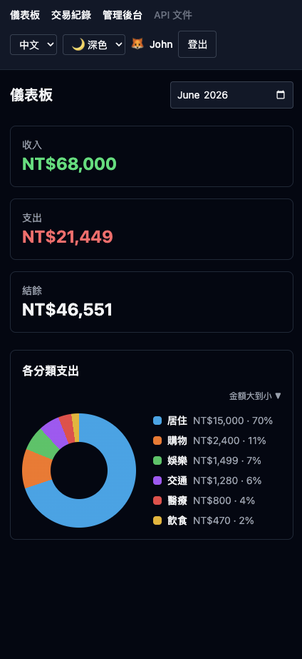
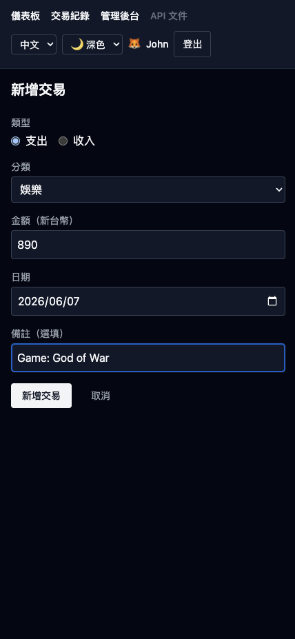
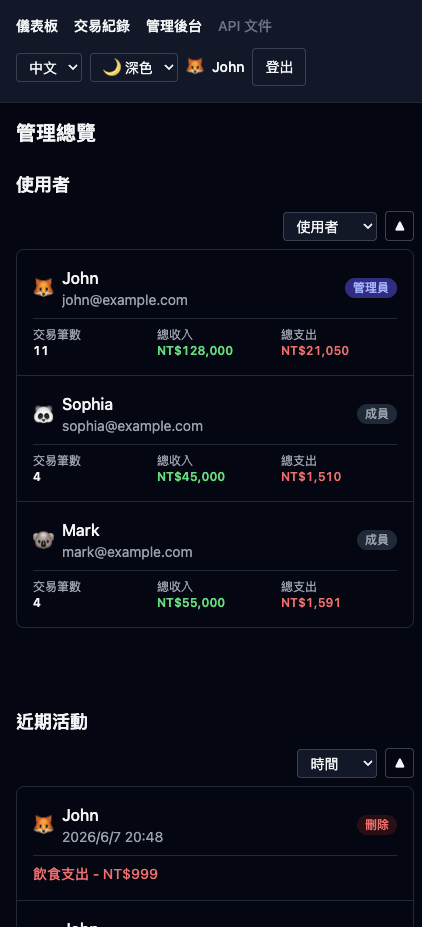
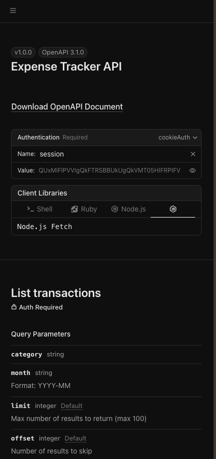
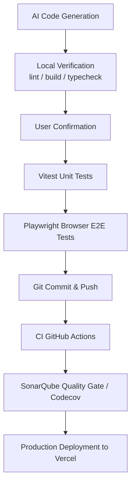

# Ultra Light Monorepo：多使用者線上記帳本 — Hono API + SvelteKit 前端

[](https://codecov.io/gh/john-data-chen/ultra-light-monorepo)
[](https://sonarcloud.io/summary/new_code?id=john-data-chen_ultra-light-monorepo)
[](https://github.com/john-data-chen/ultra-light-monorepo/actions/workflows/ci.yml)
[](https://opensource.org/licenses/MIT)

產品級別的 monorepo 架構，以真實可用的多使用者 **線上記帳本** 為核心。所有帳號都可以新增支出、收入，並查看統計資訊。管理帳號可以看到所有帳號的交易紀錄。

採用 **Turborepo monorepo** 架構，包含獨立的 **Hono.js API** 後端與 **SvelteKit** 前端，部署為兩個獨立的 Vercel 專案。UI 使用 **shadcn-svelte** 元件庫搭配 Tailwind CSS v4。

英文版本請見 **[README.md](./README.md)**。

**[Live Demo](https://ultra-light-monorepo-web.vercel.app/login)** — 按下 **以 Email 繼續** 即可用已建立的使用者登入。

<table>
  <tr>
    <td align="center"></td>
    <td align="center"></td>
    <td align="center"></td>
    <td align="center"></td>
    <td align="center"></td>
    <td align="center"></td>
  </tr>
  <tr>
    <td align="center"><b>登入畫面</b></td>
    <td align="center"><b>儀表板</b></td>
    <td align="center"><b>交易紀錄清單</b></td>
    <td align="center"><b>新增交易</b></td>
    <td align="center"><b>管理員介面</b></td>
    <td align="center"><b>API 文件</b></td>
  </tr>
</table>

---

## 專案演進 (Project Lineage)

本 monorepo 是上一代 **[sveltekit-starter-kit](https://github.com/john-data-chen/sveltekit-starter-kit)** 的次世代演進版 — 一個 production 級、完整測試的全端 SvelteKit 應用。上一代已端對端驗證產品可行性；本代則將該基礎重新架構，邁向 production 規模。

| 上一代 — [sveltekit-starter-kit](https://github.com/john-data-chen/sveltekit-starter-kit) | 本專案 — ultra-light-monorepo                                                           |
| ----------------------------------------------------------------------------------------- | --------------------------------------------------------------------------------------- |
| 單一全端 SvelteKit 應用                                                                   | 前後端分離的 **Hono.js API** + **SvelteKit** 前端，部署為兩個獨立 Vercel 專案           |
| 單一 codebase                                                                             | **Turborepo monorepo**，共用 `packages/*`（db、Zod schemas、UI）+ pnpm Catalog 版本鎖定 |
| 冷啟動 CI 建置                                                                            | **Vercel Remote Cache** — build/lint/test 產物跨機器與 CI 共享（`FULL TURBO`）          |

兩者皆為面試作品集：starter kit 展示完整、具品質門檻的 SvelteKit 產品，而本 monorepo 展示邁向解耦服務、共用套件設計與快取優化 CI/CD 的架構躍進。

### 其他作品集

**[turborepo-starter-kit](https://github.com/john-data-chen/turborepo-starter-kit)**

多平台 monorepo。Web (Next.js) + Mobile (React Native/Expo) + API (Nest.js)。

- **AI 輔助**：AI 輔助開發加速跨平台擴展。無縫切換框架。快速產出高品質專案。
- **架構**：共用商業邏輯 (狀態、驗證、i18n)。各平台保留專屬 UI。
- **品質**：80%+ Vitest 覆蓋率。SonarQube A 級。Lighthouse 90+。

---

| 指標           | 結果                                                                                       |
| -------------- | ------------------------------------------------------------------------------------------ |
| Test Coverage  | 見上方 **codecov** badge，95+% 由 Vitest（unit + integration）量測                         |
| Code Quality   | 見上方 **SonarQube Quality Gate** badge（Security、Reliability、Maintainability，全 A 級） |
| Lighthouse     | Production 環境儀表板 Lighthouse 評分 — **全 90+ 分）**                                    |
| E2E Validation | Playwright 跨瀏覽器驗證(Chrome / Safari / Edge / Mobile Chrome / Mobile Safari)            |
| CI/CD Pipeline | Gemini PR Review + GitHub Actions → SonarQube + Codecov → Vercel（自動部署到 Production）  |

---

## 生產環境 Lighthouse 儀表板審查


---

## 技術決策

### 架構

UI 以 **shadcn-svelte**（Tailwind v4 + bits-ui primitives）建構，並抽取為共用的 `packages/ui` 元件庫，可供任何 app 使用；它被視為 vendored／copy-in 程式碼（排除於 lint、format、coverage 之外）。`apps/web` 從 `@ultra-light/ui` 匯入元件；Tailwind v4 透過 `layout.css` 中的 `@source` 指令掃描 `packages/ui/src`。

| 類型          | 選擇                                           | 理由                                                                                   |
| ------------- | ---------------------------------------------- | -------------------------------------------------------------------------------------- |
| Monorepo      | Turborepo + pnpm workspaces                    | Vercel 原生整合、任務快取/編排、共享 packages                                          |
| 前端          | SvelteKit 2 + Svelte 5（runes）                | 精細的響應性、SSR + 表單操作、server-side proxy 至 Hono API                            |
| API           | Hono.js（Node runtime）                        | 輕量快速、支援 `@hono/zod-openapi`、部署為獨立 Vercel 專案                             |
| Styling       | Tailwind CSS v4 + shadcn-svelte                | 公用優先樣式搭配可組合、無障礙的 UI 元件（bits-ui）                                    |
| Database      | Prisma ORM + PostgreSQL                        | 宣告式 schema 作為唯一真相來源；型別安全的 generated client，在 `packages/db`          |
| DB Driver     | `pg`（經 `@prisma/adapter-pg`）                | Prisma v7 driver-adapter 工作流；快速 pooled driver，適合 Vercel Node serverless 服務  |
| Auth          | Password-less email + signed `httpOnly` cookie | 不儲存密碼；Hono API 為 session 驗證的唯一真相來源                                     |
| Authz/RBAC    | Hono middleware + SvelteKit hooks              | 基於資料庫使用者角色（`admin` 與 `member`）的嚴格存取控制                              |
| Rate Limiting | 記憶體內的 fixed-window 限流（Hono API）       | 簡易的防暴力破解/濫用；生產環境會改用 Vercel KV / Redis                                |
| Security      | Nonce CSP + HSTS + 強化的回應標頭              | 縱深防禦；docs UI 放寬 CSP，dev 模式移除 CSP                                           |
| Validation    | Zod（`packages/shared` 共享 schemas）          | 在 API 邊界做執行時驗證 — 編譯檢查交給 TS，輸入檢查交給 Zod                            |
| API Docs      | OpenAPI 3.1 + Scalar UI                        | 由 Hono API 於 `/api/openapi.json` + `/api/docs` 提供                                  |
| Tables        | `@tanstack/table-core`                         | Headless，排序狀態同步至 URL，純粹使用 Svelte 元件渲染                                 |
| Charts        | Pure CSS donut                                 | 不引入圖表套件，減少打包體積並保留完整控制                                             |
| i18n          | Paraglide JS（`@inlang/paraglide-js`）         | 類型安全、tree-shakeable 翻譯；支援英文與繁體中文                                      |
| Deploy        | 兩個 Vercel 專案（web + api）                  | SvelteKit 使用 `adapter-vercel`，Hono API 使用 `@hono/node-server`；Turborepo 驅動建置 |

### Monorepo 建置流程

套件版本集中管理，`apps/*` 與 `packages/*` 不再宣告衝突的版本；Turborepo 任務圖同時做本機 **與** 遠端快取，達成快速且可重現的建置。

**pnpm Catalog（版本的唯一真相來源）** — 共用依賴在 `pnpm-workspace.yaml` 的 `catalog:` 只宣告一次；各 package 以 `"dep": "catalog:"` 引用。

| 優點           | 說明                                                                            |
| -------------- | ------------------------------------------------------------------------------- |
| 零版本漂移     | 全 repo 每個依賴只有一個版本（typescript、vitest、svelte、prisma 套件群、zod…） |
| 一行升級       | 只改 `pnpm-workspace.yaml` 一處，所有 package 跟著更新                          |
| 穩定 cache key | 解析後版本一致 → Turborepo hash 穩定 → 提高快取命中率                           |

**Turborepo Remote Cache（Vercel）** — `turbo link` 將 repo 連到 Vercel team；build/lint/test 產物跨機器與 CI 共享。

| 優點            | 說明                                                                                                             |
| --------------- | ---------------------------------------------------------------------------------------------------------------- |
| 共享運算        | 一台機器（或 CI）跑過的任務，所有地方都能還原 — 同一 hash 不重算第二次                                           |
| CI `FULL TURBO` | 未變動的 package 從快取秒級還原，不必重跑 build/test                                                             |
| 全團隊命中      | 隊友與 CI 拉取同一份快取，乾淨 checkout 也能首次命中                                                             |
| 精準失效        | 每個 task 在 `turbo.json` 明確宣告 `inputs`/`outputs`/`env`（如測試用 `DATABASE_URL`），只有相關變動才使快取失效 |

所有指令皆從 repo 根目錄經 Turborepo 執行（`pnpm lint` / `pnpm format` / `pnpm test` / `pnpm build`）；共用設定放在 `vitest.shared.ts` 與 `packages/typescript-config/base.json`。

### 品質保證

| 類型              | 工具       | 理由                                             |
| ----------------- | ---------- | ------------------------------------------------ |
| Unit/Integration  | Vitest     | 比 Jest 更快，原生 ESM，與 Vite 生態整合佳       |
| E2E               | Playwright | 跨瀏覽器支援，比 Cypress 更輕量                  |
| Static Analysis   | SonarQube  | 在 CI 中執行 quality gates 程式碼 bad smell 檢查 |
| Coverage Tracking | Codecov    | 自動整合 PR coverage                             |

**Testing Strategy:**

- Unit tests 聚焦查詢邏輯、驗證、貨幣 格式化 / 解析
- E2E tests 驗證重要流程（登入、transaction CRUD）
- 每次推送/PR 都會先運行整個 pipeline，由 Gemini 進行初審，然後開發者再複查。只有兩次審核都通過後才會合併（免費伺服器效能不足，因此 CI 只執行單元測試，端對端測試在本機上執行）。

### Developer Experience

| 工具                    | 用途                                                     |
| ----------------------- | -------------------------------------------------------- |
| oxlint                  | Rust-based JS/TS linter，比 ESLint 快 50-100 倍          |
| oxfmt                   | Rust-based formatter，處理 JS/TS/CSS/HTML/JSON/MD/Svelte |
| ESLint（Svelte）        | 專門處理 `.svelte` 檔案的 lint（啟用 content-hash 快取） |
| Vite                    | 近乎即時的 HMR 與快速建置                                |
| Husky + lint-staged     | pre-commit 品質檢查                                      |
| commitlint + Commitizen | Conventional commits，維持乾淨 commit history            |

### 架構決策紀錄 (ADR)

| 決策                                                         | 原因                                                                                                                                                                                                                                                                                                             |
| ------------------------------------------------------------ | ---------------------------------------------------------------------------------------------------------------------------------------------------------------------------------------------------------------------------------------------------------------------------------------------------------------- |
| 保留 `svelte.config.js`，不將所有設定整合到 `vite.config.ts` | SvelteKit ≥ 2.62.0 可使用 `sveltekit()` 將 `svelte.config.js` 內容整合到 `vite.config.ts`，但 `svelte-check`、`eslint-plugin-svelte` 與 IDE (VS Code..etc) 仍需讀取 `svelte.config.js` 取得強制 runes 設定。新做法必須放棄原先默認的設定，推翻慣例也許會讓其他接手的開發者感到疑惑，權衡利弊後決定使用原先做法。 |
| 採用 shadcn-svelte 並抽取為 `packages/ui`                    | 可組合、無障礙的 bits-ui primitives；共用元件庫，視為 vendored 程式碼（排除於 lint/format/coverage）                                                                                                                                                                                                             |
| Vercel Node 用 pooled `pg` TCP driver（非 Edge）             | 可靠連線池、免 proxy、本機 Docker 跑相同 Postgres                                                                                                                                                                                                                                                                |
| Zod schema = 單一真相來源                                    | 一份 schema → 驗證 + TS 型別 + OpenAPI 3.1；零落差                                                                                                                                                                                                                                                               |

---

## 功能

- **Password-less email login** — 內建三個帳號（`john@example.com` (Admin)、`sophia@example.com` (Member)、`mark@example.com` (Member)）；表單預填 `john@example.com`，按一次即可登入。`userId` 會存放在 signed `httpOnly` session cookie。
- **角色與權限 (Roles & Permissions)** — "member"（預設）只能看見並操作自己的記帳資料；"admin" 則可存取 `/admin` 管理介面，總覽所有使用者的平台使用狀況（Governance）。
- **稽核日誌 (Audit Log)** — 紀錄使用者變更（新增、修改、刪除），顯示於管理員 Governance 介面中。
- **Transactions CRUD** — 可新增、查看、編輯、刪除收入/支出紀錄（數目、類型、類別、日期、備註）。
- **Sortable data-tables (TanStack)** — 交易清單與管理員報表皆採用 TanStack Table 實作排序功能，並且排序狀態會與 URL 同步。
- **List & filter** — 可依 類型 與 月份 篩選交易紀錄；查詢條件會保存在 URL。
- **Dashboard** — 顯示當月收入、支出、結餘，以及以 原生CSS 製作的類型圓環圖 (無依賴圖表庫，支援大/小切換)。
- **REST API + OpenAPI 互動文件** — 提供完整的 CRUD endpoints (`/api/transactions`, `/api/stats`)，重度利用 Zod 模型來動態對應出即時的 OpenAPI 3.1 規範。同時於 `/api/docs` 掛載了 Scalar UI 以供互動式探索。
- **Per-user data isolation** — 每個查詢都會以登入使用者做限制；使用者只能看到自己的資料。
- **Schema migration 與驗證** — PostgreSQL schema 以 Prisma Migrate 做版本控管（`db:migrate`），所有不可信輸入都在邊界經由 Zod 驗證；單一 schema 同時是型別、驗證與 OpenAPI 規範的唯一真相來源。
- **限流 (Rate limiting)** — best-effort 記憶體內 fixed-window 限流：登入每 IP 每分鐘上限 10 次，已驗證的 API 寫入每 IP 每分鐘上限 100 次，超過時回傳 `429` 並附上 `Retry-After` header。（serverless 環境下應改用 Vercel KV / Upstash Redis 讓多實例共享狀態。）
- **安全強化 (Security hardening)** — 每個 HTML 回應都帶有 nonce-based Content-Security-Policy，以及 `X-Content-Type-Options`、`X-Frame-Options: DENY`、`Referrer-Policy`、`Permissions-Policy`；production 另啟用 `Strict-Transport-Security`。僅 Scalar `/api/docs` 頁面放寬 CSP，dev 模式則移除 CSP 以支援 Vite HMR。
- **API 分頁 (Pagination)** — `GET /api/transactions` 接受 `limit`（預設 20，上限 100）與 `offset`，並回傳 `{ data, pagination: { total, limit, offset } }` 封裝。
- **Currency** — 僅支援 TWD，金額以整數儲存，不使用小數。
- **i18n** — 英文與繁體中文（Paraglide JS）。
- **Theme switching** — 淺色 / 深色 / 系統。
- **Responsive design** — 手機小螢幕排版優先，也支援電腦大螢幕排版。
- **Web analytics** — 全站注入 Vercel Web Analytics（`@vercel/analytics`），提供注重隱私、不使用 cookie 的流量洞察。
- **SEO 與可被搜尋性** — 登入著陸頁提供在地化的 meta description（`seo_description`）、canonical URL、theme-color、Open Graph 與 Twitter Card 標籤，以及 JSON-LD `WebApplication` 結構化資料；並從 `static/` 提供 `sitemap.xml` 與 `robots.txt` 的 `Sitemap:` 指令。

Category 固定定義於 `src/lib/categories.ts`；session cookie 使用 `.env` 中的 `SESSION_SECRET` 簽章。

---

## 角色與權限 (Roles & Permissions) / Governance

應用程式強制執行基於資料庫角色的資料權限邊界。這正是企業系統（ERP / BPM / 內部後台工具）所仰賴的存取控制與監督樣式：role-based access control、逐使用者資料隔離、稽核軌跡（audit trail），以及僅供讀取的治理／合規檢視。

- **成員 (Member)**：只能存取自己的儀表板與交易紀錄。資料在查詢層級即做到單一使用者隔離。
- **管理員 (Admin)**：視為受信任的合規/治理稽核員。受到伺服器端 `requireAdmin` 守衛保護的 `/admin` 總覽介面僅供讀取。為了方便平台監督，設計上允許管理員在稽核日誌 (Audit Trail) 中看見單筆紀錄細節（例如單筆交易金額與分類）。

管理員 Governance 介面彙整逐使用者活動（交易筆數、所有成員的總收入／支出），並搭配新增／修改／刪除事件的稽核軌跡 — 這正是企業後台工具（ERP／BPM／內部系統）所需的跨使用者監督與合規可視性。

---

## REST API 與 OpenAPI 文件

**[Live API 文件 →](https://ultra-light-monorepo-web.vercel.app/api/docs)** — 互動式 OpenAPI 3.1 參考文件（Scalar UI）。

API 文件為公開：瀏覽 `/api/docs` 或 `/api/openapi.json` 不需登入或權限，且每位訪客（無論是否登入）都會在 app header 看到 **API Docs** 連結。

獨立的 REST 層（`/api/transactions`、`/api/stats`）提供完整 CRUD，含 cookie-based 驗證、逐使用者資料隔離、分頁與 `429` 限流 — 這正是前端、行動端或外部系統整合會串接的 API／資料流／權限邊界。每個 endpoint 的請求／回應形狀都以單一 **Zod schema** 定義（唯一真相來源），同時驅動執行時驗證與 `/api/openapi.json` 的即時 OpenAPI 3.1 規範，並透過 `/api/docs` 的 Scalar 呈現。文件由 schema 產生，因此永遠不會與實作脫節。

---

## 駕馭工程 (Harness Engineering)

這個專案採用 Human-in-the-Loop 的 AI 協作方式。AI 工具不只是產生程式碼，而是被用來提高 **架構槓桿、品質保證與開發速度**。

AI agent 是受治理的協作開發者，而非可自行 commit 的自動程式。

- **Human-in-the-loop** — 每個指令與變更都經審查；不自行執行。
- **Prompt 與 task template** — 每個 session 先定好角色、可動範圍與通過標準（lint／build／check／tests）。
- **Context 管理** — 範圍限縮在 `src/`；可重用的已提交 skills；離線參考文件。
- **Skill 與 task 拆解** — 唯讀規劃 → 人工審查 → 單步執行 → 逐步驗證。
- **生成邊界控制** — Zod 強制 I/O contract；測試 mock PostgreSQL／第三方；HSTS／CSP 依 `dev` 與 prod 切換。
- **Session handoff** — task 與 session log 讓任何模型從中斷處包含但不限於 token 或 session 耗盡 / 不可預期的崩潰 接手。
- **Token 紀律** — 所有 AI 工作都透過全域 **caveman** skill 進行，以降低 token 消耗；輸出保持精簡但完整保留技術內容。
- **交付紀律** — 每次變更都明確掌握需求、風險與影響範圍，並須通過上線前驗證（lint／build／check／tests）才能合併。

### 可衡量的影響

透過將 AI 整合到技術堆疊中，本專案實現了以下目標：

- **速度**：樣板程式碼和標準模式的實現速度提升 5-10 倍，借助 Gemini Code Assist 將 PR 審查時間縮短 30-40%。
- **品質**：透過 AI 產生的測試框架，實現更高的測試覆蓋率（80% 以上）。以及 Gemini Code Assist 的 PR 審查，從而減少 bug 和程式碼異味。
- **學習**：透過 AI 指導的實現，快速掌握新工具（Svelte、Sveltekit、Prisma 等）。
- **成本**：利用 AI 代理的技能減少程式碼迭代次數並遵循最佳實踐，從而降低成本。
- **專注**：將工程時間從語法開發轉移到系統架構和使用者體驗。

### AI Agent Skills（`.agents/skills/`）

Skills 會提交到 repo，並透過 `AGENTS.md` / `CLAUDE.md` 提供給 AI assistants。每個 skill 都封裝了特定工作流與專案慣例。

| Skill                                                                                                                                 | 職責                                                                                        |
| ------------------------------------------------------------------------------------------------------------------------------------- | ------------------------------------------------------------------------------------------- |
| [karpathy-guidelines](https://github.com/forrestchang/andrej-karpathy-skills)                                                         | 降低 LLM 程式碼錯誤：明確假設、優先簡單方案、手術刀式修改、目標導向循環                     |
| [doc-coauthoring](https://github.com/anthropics/skills/tree/main/skills/doc-coauthoring)                                              | 文件共筆的 3 階段工作流程（上下文 → 精煉 → 讀者測試），本 README 由此技能與作者共同協作產生 |
| **session-handoff (my private skill)**                                                                                                | 維護 `ai-docs/tasks.md` + `ai-docs/session-log.md`，讓跨模型/跨 session 接手時沒有資訊斷層  |
| [prisma official AI guide](https://www.prisma.io/docs/ai)（cli、client-api、database-setup、postgres、driver-adapter-implementation） | Prisma ORM 工作流：CLI 指令、client API、provider 設定、Prisma Postgres、driver adapters    |
| [svelte-code-writer](https://svelte.dev/docs/ai/skills)                                                                               | 用於在建立/編輯任何 `.svelte` 檔案時尋找技術文件和進行程式碼分析的 CLI 工具                 |
| [svelte-core-bestpractices](https://svelte.dev/docs/ai/skills)                                                                        | 編寫快速、健壯、現代的 Svelte 程式碼的指南。                                                |

> **[caveman](https://github.com/juliusbrussee/caveman)** 為全域 skill（未提交至 `.agents/skills/`）。它精簡所有 AI 輸出以降低 token 消耗（60-90%），本 repo 每項任務皆使用。

### MCP（Model Context Protocol）Servers

MCP 讓 AI 工具可直接和開發基礎設施互動，從而消除上下文切換 (人工介入) 的 token 開銷。

| Server                                                                       | Integration Point | Workflow Enhancement                                                              |
| ---------------------------------------------------------------------------- | ----------------- | --------------------------------------------------------------------------------- |
| [svelte-mcp](https://svelte.dev/docs/ai/mcp)                                 | Svelte docs       | 官方 Svelte 5 / SvelteKit docs、examples、code autofixing（已提交於 `.mcp.json`） |
| [context7](https://github.com/upstash/context7)                              | Documentation     | 提供 AI agents version-accurate 的即時 library docs                               |
| [chrome-devtools-mcp](https://github.com/ChromeDevTools/chrome-devtools-mcp) | Browser state     | 讓 AI agents 透過 DevTools Protocol 檢查與驗證正在執行的 app                      |

### AI Guidelines（`AGENTS.md` / `CLAUDE.md`）

這些檔案是 AI 輔助開發的專案工作守則，包含主要驗證流程（`pnpm lint` → `pnpm build` → `pnpm check`）、常用指令，以及不同任務應使用的 skills/MCP servers。AI 在修改此專案前應先讀取這些指引。

## 安裝與執行 (Setup Instructions)

1. `pnpm install`
2. 參考 `.env.example` 設定 `.env`。
3. `pnpm db:push` / `pnpm db:seed`
4. `pnpm dev`

## Vercel 部署 (Vercel Deployment)

本專案將 SvelteKit 前端與 API 後端拆分為 **兩個獨立的 Vercel 專案** 部署，以實現解耦和獨立擴展。

1. **API 專案** (`apps/api`)：
   - **Framework Preset**: None / Other (或使用 Vercel 預設的 Node)
   - **Build Command**: `turbo run build --filter=@ultra-light/api`（此步驟會使用 `esbuild` 打包 workspace 依賴，並執行 `prisma generate`）。
   - **環境變數 (Environment Variables)**:
     - `DATABASE_URL` (必須指向正式環境的 PostgreSQL 實例，如 Prisma Postgres 或 Neon)
     - `SESSION_SECRET` (一組長度足夠的隨機字串)

2. **Web 專案** (`apps/web`)：
   - **Framework Preset**: SvelteKit
   - **Build Command**: `turbo run build --filter=@ultra-light/web`
   - **環境變數 (Environment Variables)**:
     - `API_BASE_URL` (指向已部署的 API 專案 URL，例如 `https://your-api-project.vercel.app`)
     - `SESSION_SECRET` (必須與 API 專案設定的 secret 完全相同)

> **注意：關於 Workspaces 依賴與 Vercel:** Vercel 預設的 Node.js builder 在執行期無法解析 TypeScript workspace 依賴（如 `@ultra-light/shared`、`@ultra-light/db`）。為了解決此問題，`apps/api` 的 build script 會在部署前將 API 進入點與所有 workspace 依賴打包成單一個可執行的 JavaScript 檔案（`api/index.js`）。

---

人機協作開發流程：



---

## Quick Start

### Requirements

- Node.js >= 24
- pnpm 11.5+
- Docker / OrbStack（本機 PostgreSQL）

### Setup

```bash
pnpm install

# Environment — set DATABASE_URL + SESSION_SECRET
cp .env.example .env

# Database
pnpm db:start          # Start PostgreSQL via Docker (compose.yaml)
pnpm db:migrate        # Apply migrations to the local DB
pnpm db:seed           # Seed 3 demo users + sample transactions

# Run
pnpm dev               # Development server
pnpm test              # Unit tests
pnpm test:e2e          # E2E tests (needs a seeded DB + dev server)
pnpm build             # Production build
```

`.env.example` 的預設 `DATABASE_URL` 與 `compose.yaml` 相符。請將 `SESSION_SECRET` 設成一段足夠長的隨機字串 (如使用指令 `openssl rand -base64 32` 產生)，用來簽署 session cookie。接著開啟 dev server（預設 `http://localhost:5173`），按下 **以 Email 繼續** 即可用 `john@example.com` 登入。

### Commands

```bash
pnpm dev           # Start dev server
pnpm build         # TypeScript compile + Vite build
pnpm preview       # Preview production build
pnpm lint          # oxlint --fix (JS/TS) + eslint（Svelte，啟用快取）
pnpm format        # oxfmt --write .
pnpm test          # vitest run
pnpm test:coverage # vitest run --coverage
pnpm test:e2e      # Playwright e2e
pnpm check         # svelte-kit sync + svelte-check
pnpm commit        # git-cz (commitizen with commitlint)
pnpm db:start      # docker compose up (PostgreSQL)
pnpm db:generate   # prisma generate
pnpm db:migrate    # prisma migrate dev
pnpm db:push       # prisma db push
pnpm db:seed       # Seed demo users + sample transactions
```

### 測試架構

- **雙專案模式**: `server`（Node.js，後端工具與 API）與 `client`（JSDOM，Svelte 元件與 runes）。
- **命名規範**:
  - `*.spec.ts`: 於 `server` 環境執行。
  - `*.svelte.spec.ts`: 於 `client`（JSDOM）環境執行。
- **常用指令**:
  - `pnpm test`: 執行所有 Vitest 單元測試。
  - `pnpm test:coverage`: 執行測試覆蓋率（各套件門檻：`packages/shared` ≥90%；`apps/api`、`apps/web` 因 mock DB 與 bits-ui portal／SSR proxy 程式碼採務實下限；`packages/db` best-effort）。
  - `pnpm test:e2e`: 執行 Playwright 瀏覽器 E2E 測試（chromium、webkit、mobile chrome/safari）。
- **元件測試範例**:
  ```ts
  import { render, screen } from "@testing-library/svelte";
  import Button from "./Button.svelte";
  render(Button, { props: { children: () => "Click" } });
  expect(screen.getByRole("button", { name: "Click" })).toBeTruthy();
  ```

---

## Project Structure

```text
.
├── apps/
│   ├── web/                          # SvelteKit 前端（SSR proxy 到 Hono API）
│   │   ├── src/
│   │   │   ├── app.d.ts              # SvelteKit 環境型別宣告
│   │   │   ├── app.html              # HTML shell 模板
│   │   │   ├── hooks.server.ts       # SvelteKit server hooks（CSP nonce、session、HSTS）
│   │   │   ├── lib/
│   │   │   │   ├── components/       # 功能元件
│   │   │   │   │   ├── CategoryChart.svelte    # 純 CSS donut 圓環圖
│   │   │   │   │   ├── LocaleSwitcher.svelte   # i18n 語言切換器
│   │   │   │   │   ├── ThemeToggle.svelte      # 淺色/深色/系統主題切換器
│   │   │   │   │   └── TransactionForm.svelte  # 新增/編輯交易表單
│   │   │   │   ├── server/           # 僅限伺服器端使用的 helpers
│   │   │   │   │   ├── api.ts        # apiFetch() — SSR proxy 至 Hono API
│   │   │   │   │   ├── auth.ts       # requireAuth 守衛
│   │   │   │   │   └── session.ts    # Session cookie 讀寫
│   │   │   │   ├── table/            # TanStack Table 工具
│   │   │   │   │   ├── sort.ts       # URL 同步排序 helpers
│   │   │   │   │   └── sorted-table.svelte.ts  # Headless 排序表格 rune
│   │   │   │   ├── paraglide/        # Paraglide i18n 生成的 runtime
│   │   │   │   ├── categories.ts     # 客戶端 category 標籤解析
│   │   │   │   ├── theme.svelte.ts   # 主題 rune（淺色/深色/系統）
│   │   │   │   └── money.ts          # TWD 格式化 helpers
│   │   │   └── routes/               # SvelteKit 頁面 + server load/actions
│   │   │       ├── +layout.svelte    # 根 layout（analytics、theme、nav）
│   │   │       ├── +layout.server.ts # 根 layout server load（session 守衛）
│   │   │       ├── +page.svelte      # 儀表板（統計 + donut 圖）
│   │   │       ├── +page.server.ts   # 儀表板資料載入
│   │   │       ├── layout.css        # 全域樣式 + Tailwind @source
│   │   │       ├── login/            # 免密碼 email 登入頁
│   │   │       ├── logout/           # 登出 action
│   │   │       ├── transactions/     # 交易清單 + CRUD 頁面
│   │   │       └── admin/            # 管理員治理介面（僅限 admin）
│   │   ├── vite.config.ts            # Tailwind、SvelteKit、Paraglide、Vitest
│   │   └── components.json           # shadcn-svelte 設定
│   └── api/                          # Hono.js API（所有商業邏輯）
│       └── src/
│           ├── routes/               # 路由處理
│           │   ├── transactions.ts   # CRUD + 分頁
│           │   ├── stats.ts          # 月度統計聚合
│           │   ├── auth.ts           # /api/auth（session 驗證）
│           │   ├── login.ts          # /api/login（免密碼 email）
│           │   ├── admin.ts          # /api/admin（僅限管理員治理）
│           │   └── docs.ts           # /api/docs（Scalar UI 掛載）
│           ├── middleware/
│           │   ├── auth.ts           # Cookie session 驗證 middleware
│           │   └── rate-limit.ts     # 記憶體內 fixed-window 限流
│           ├── openapi.ts            # OpenAPI 3.1 規範定義
│           ├── index.ts              # App 進入點（掛載路由、@hono/node-server）
│           ├── vercel.ts             # Vercel serverless 進入點轉接器
│           └── types.ts              # Hono generics 用的 AppEnv 型別
├── packages/
│   ├── db/                           # Prisma schema + migrations + generated client
│   │   ├── prisma/
│   │   │   ├── schema.prisma         # Prisma schema（User、Transaction、AuditLog）
│   │   │   └── migrations/           # SQL migration 歷史
│   │   └── src/
│   │       ├── index.ts              # 資料庫套件進入點
│   │       ├── client.ts             # PrismaClient 單例（pg driver adapter）
│   │       ├── queries.ts            # 型別安全的查詢 helpers（transactions、stats）
│   │       ├── audit.ts              # 稽核日誌寫入 helpers
│   │       ├── admin.ts              # 管理員聚合查詢
│   │       ├── schema.ts             # Prisma schema 重新匯出 / 型別 helpers
│   │       ├── seed.ts               # Demo 使用者 + 範例交易資料
│   │       └── generated/            # Prisma 生成的 client（git-ignored）
│   ├── shared/                       # 共用 Zod schemas + 領域型別
│   │   └── src/
│   │       ├── index.ts              # 共用套件進入點
│   │       ├── schemas.ts            # Zod 請求/回應 schemas
│   │       ├── categories.ts         # Category 鍵值 + metadata
│   │       ├── transaction.ts        # Transaction 領域型別
│   │       ├── types.ts              # 共用 TS 型別（Role 等）
│   │       ├── constants.ts          # 全域常數
│   │       ├── date.ts               # 日期格式化工具
│   │       └── money.ts              # TWD 整數 ↔ 顯示轉換
│   ├── ui/                           # shadcn-svelte 元件庫（vendored；排除於 lint/format/coverage）
│   │   └── src/
│   │       ├── index.ts              # UI 套件進入點
│   │       ├── button/               # Button 元件
│   │       ├── card/                 # Card 元件
│   │       ├── input/                # Input 元件
│   │       ├── select/               # Select 元件
│   │       ├── label/                # Label 元件
│   │       ├── field/                # Field（表單欄位 wrapper）
│   │       ├── separator/            # Separator 元件
│   │       ├── alert-dialog/         # Alert dialog 元件
│   │       ├── ConfirmDialog.svelte  # 組合式確認對話框
│   │       └── utils.ts              # cn() class-merge 工具
│   └── typescript-config/            # 共用基礎 tsconfig
│       └── base.json
├── e2e/                              # Playwright E2E 測試
│   ├── expense.spec.ts               # 交易 CRUD 流程
│   ├── admin.spec.ts                 # 管理員治理流程
│   ├── sort.spec.ts                  # 表格排序 + URL 同步
│   ├── global-setup.ts               # E2E 前置 DB seed
│   └── global-teardown.ts            # E2E 後置 DB 清理
├── .agents/skills/                   # AI skills（karpathy、shadcn-svelte、hono、prisma 等）
├── .github/workflows/ci.yml          # GitHub Actions：透過 turbo 執行 build、lint、check、test
├── ai-docs/                          # AI 協作的 task plan + session log
├── compose.yaml                      # Docker Compose — 本機 PostgreSQL
├── playwright.config.ts              # Playwright 瀏覽器矩陣設定
├── eslint.config.js                  # .svelte 檔案的 ESLint config
├── .oxlintrc.json                    # oxlint 規則（JS/TS）
├── .oxfmtrc.json                     # oxfmt formatter 設定
├── .mcp.json                         # MCP server 設定（svelte、context7 等）
├── commitlint.config.mjs             # Conventional commit 規則
├── sonar-project.properties          # SonarQube 專案設定
├── vitest.shared.ts                  # 共用 Vitest 基礎設定（api/db/shared 繼承）
├── turbo.json                        # Turborepo pipeline + 遠端快取（每 task 明確 inputs/outputs/env）
├── pnpm-workspace.yaml               # Workspace 定義 + catalog（集中管理依賴版本）
└── package.json                      # 委派給 turbo 的根 scripts
```

---

## 新世代工具採用

這個專案會持續評估新興工具，並根據可量測的效益決定是否採用。

### Oxlint（Rust-based Linter）

| 面向        | 說明                                                            |
| ----------- | --------------------------------------------------------------- |
| Status      | **Production** — 已啟用 JS/TS linting                           |
| Performance | 比 ESLint 快 50-100 倍                                          |
| Scope       | ESLint 檢查 `.svelte`（基於內容雜湊快取）；JS/TS 由 oxlint 處理 |

[Oxlint](https://oxc.rs/docs/guide/usage/linter.html)

### Oxfmt（Rust-based Formatter）

| 面向        | 說明                                                  |
| ----------- | ----------------------------------------------------- |
| Status      | **Production** — 格式化 JS/TS/CSS/HTML/JSON/MD/Svelte |
| Performance | 約比 Prettier 快 30 倍，冷啟動幾乎即時                |
| Scope       | 格式化所有支援的檔案，包含 `.svelte`                  |

[Oxfmt](https://oxc.rs/docs/guide/usage/formatter)

---

## Live Demo Constraints

| 面向         | 目前狀態                                                             | Production 建議               |
| ------------ | -------------------------------------------------------------------- | ----------------------------- |
| **Hosting**  | Vercel free tier                                                     | Paid tier / 多區域 deployment |
| **Database** | Free-tier Neon                                                       | 根據地區優化的 DB             |
| **Data**     | 預先建立的 Demo 資料；示範帳號由訪客共用，但每個帳號的資料仍彼此隔離 | 真實帳號隔離                  |

Demo 使用免費等級以降低成本。Production 應根據真實使用者地區補上適當的地區性優化。
