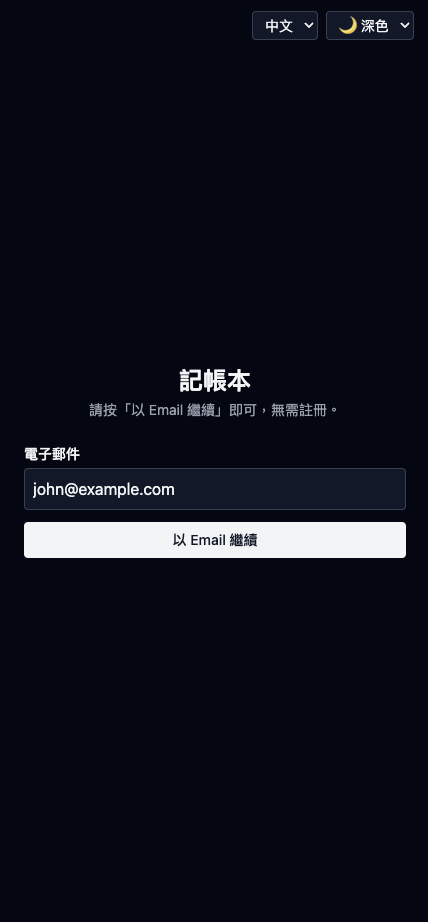
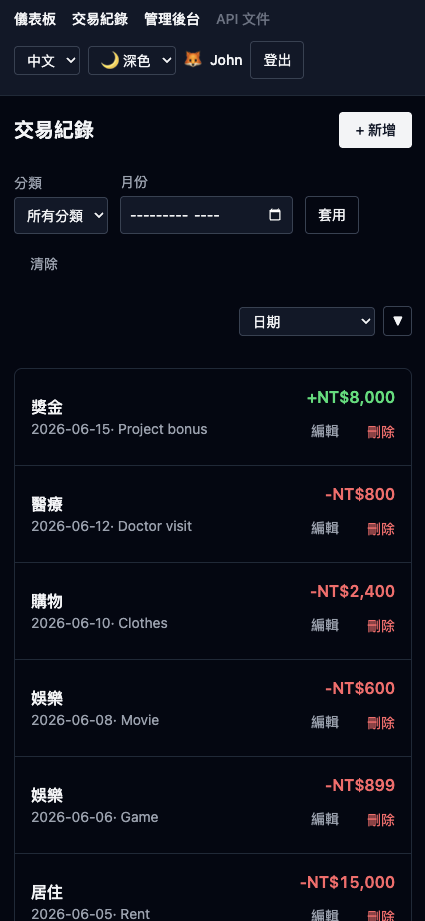
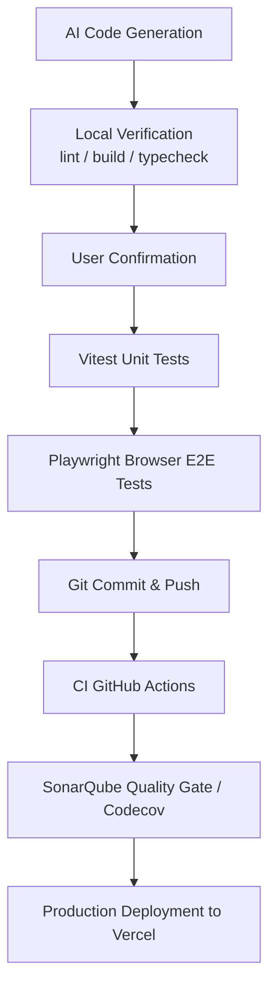

# Ultra Light Monorepo: Multi-user Online Ledger with Hono API + SvelteKit Frontend

[](https://codecov.io/gh/john-data-chen/ultra-light-monorepo)
[](https://sonarcloud.io/summary/new_code?id=john-data-chen_ultra-light-monorepo)
[](https://github.com/john-data-chen/sveltekit-starter-kit/actions/workflows/ci.yml)
[](https://opensource.org/licenses/MIT)

A product-level monorepo centered around a real, multi-user (family) **online ledger**, where all accounts can add expenses and income, and view statistics. The administrator account can view the transaction history of all accounts.

Built as a **Turborepo monorepo** with a standalone **Hono.js API** backend and a **SvelteKit** frontend, deployed as two separate Vercel projects. UI uses **shadcn-svelte** components with Tailwind CSS v4.

**[Live Demo](https://sveltekit-starter-kit.vercel.app/login)** — press **Continue With Email** to sign in instantly as a seeded demo user.
**[Live API Docs](https://sveltekit-starter-kit.vercel.app/api/docs)** — interactive OpenAPI 3.1 reference (Scalar UI).

繁體中文版本請見 **[README-cht.md](./README-cht.md)**.

<table>
  <tr>
    <td align="center"></td>
    <td align="center"></td>
    <td align="center"></td>
    <td align="center"></td>
    <td align="center"></td>
    <td align="center"></td>
  </tr>
  <tr>
    <td align="center"><b>Login</b></td>
    <td align="center"><b>Dashboard</b></td>
    <td align="center"><b>Transactions</b></td>
    <td align="center"><b>Add Record</b></td>
    <td align="center"><b>Admin</b></td>
    <td align="center"><b>API Docs</b></td>
  </tr>
</table>

---

| Metric         | Result                                                                                           |
| -------------- | ------------------------------------------------------------------------------------------------ |
| Test Coverage  | See **codecov** badge above — 95+% via Vitest (unit + integration)                               |
| Code Quality   | See **SonarQube Quality Gate** badge above (Security, Reliability, Maintainability, all A level) |
| Lighthouse     | Production Lighthouse audit of the dashboard — **all 90+ scores**                                |
| E2E Validation | Cross-browser via Playwright (Chrome / Safari / Edge / Mobile Chrome / Mobile Safari)            |
| CI/CD pipeline | GitHub Actions → Gemini PR Review + SonarQube + Codecov → Vercel                                 |

---

## Production Lighthouse audit of the dashboard


---

## Technical Decisions

### Architecture

UI is built on **shadcn-svelte** (Tailwind v4 + bits-ui primitives), extracted into a shared `packages/ui` library so it can be consumed by any app and is treated as vendored/copy-in code (excluded from lint, format, and coverage). `apps/web` imports components from `@ultra-light/ui`; Tailwind v4 scans `packages/ui/src` via an `@source` directive in `layout.css`.

| Type          | Choice                                         | Rationale                                                                                                     |
| ------------- | ---------------------------------------------- | ------------------------------------------------------------------------------------------------------------- |
| Monorepo      | Turborepo + pnpm workspaces                    | First-party Vercel integration, task caching/orchestration, shared packages                                   |
| Frontend      | SvelteKit 2 + Svelte 5 (runes)                 | Fine-grained reactivity, SSR + form actions, server-side proxy to Hono API                                    |
| API           | Hono.js (Node runtime)                         | Lightweight, fast, OpenAPI support via `@hono/zod-openapi`, deployed as separate Vercel project               |
| Styling       | Tailwind CSS v4 + shadcn-svelte                | Utility-first styling with composable, accessible UI primitives (bits-ui)                                     |
| Database      | Prisma ORM + PostgreSQL                        | Declarative schema as single source of truth; type-safe generated client, in `packages/db`                    |
| DB Driver     | `pg` via `@prisma/adapter-pg`                  | Prisma v7 driver-adapter workflow; fast pooled driver, pairs with the Vercel Node serverless runtime          |
| Auth          | Password-less email + signed `httpOnly` cookie | No password storage; Hono API is single source of truth for session validation                                |
| Authz/RBAC    | Hono middleware + SvelteKit hooks              | Strict access control based on DB-backed user roles (`admin` vs `member`)                                     |
| Rate Limiting | In-memory fixed-window limiter (Hono API)      | Simple protection against brute-force attacks/abuse; Vercel KV/Redis will be used in production environments. |
| Security      | Nonce CSP + HSTS + hardened response headers   | Defense-in-depth; relaxed CSP for docs UI, stripped in dev for Vite HMR                                       |
| Validation    | Zod (shared schemas in `packages/shared`)      | Runtime validation at API boundaries — TS at compile time, Zod for untrusted input                            |
| API Docs      | OpenAPI 3.1 + Scalar UI                        | Spec served by Hono API at `/api/openapi.json` + `/api/docs`                                                  |
| Tables        | `@tanstack/table-core`                         | Headless, URL-synchronized sorting, rendered via pure Svelte components                                       |
| Charts        | Pure CSS donut                                 | Zero charting dependency — smaller bundle, full control                                                       |
| i18n          | Paraglide JS (`@inlang/paraglide-js`)          | Type-safe, tree-shakeable messages; English + Traditional Chinese                                             |
| Deploy        | Two Vercel projects (web + api)                | SvelteKit on `adapter-vercel`, Hono API on `@hono/node-server`; Turborepo drives build pipeline               |

### Quality Assurance

| Type              | Tool       | Rationale                                   |
| ----------------- | ---------- | ------------------------------------------- |
| Unit/Integration  | Vitest     | Faster than Jest, native ESM, Vite-native   |
| E2E               | Playwright | Cross-browser support, lighter than Cypress |
| Static Analysis   | SonarQube  | Quality gates bad smell scan enforced in CI |
| Coverage Tracking | Codecov    | Automated PR integration                    |

**Testing Strategy:**

- Unit tests target query logic, validation, and money formatting/parsing
- E2E tests validate critical flows (login, transaction CRUD)
- Each push/PR will first run the entire pipeline, be initially reviewed by Gemini, and then I will review it again. Only after both pass will it be merged (the free server performance is not enough, so CI only executes unit tests, and E2E runs on the local machine).

### Developer Experience

| Tool                    | Purpose                                                              |
| ----------------------- | -------------------------------------------------------------------- |
| oxlint                  | Rust-based linter for JS/TS, 50-100x faster than ESLint              |
| oxfmt                   | Rust-based formatter (JS/TS/CSS/HTML/JSON/MD/Svelte)                 |
| ESLint (Svelte)         | Svelte-aware linting for `.svelte` files (with content-hash caching) |
| Vite                    | Near-instant HMR and fast production builds                          |
| Husky + lint-staged     | Pre-commit quality enforcement                                       |
| commitlint + Commitizen | Conventional commits for a clean history                             |

### Architecture Decision Records (ADR)

| Decision                                                                     | Why                                                                                                                                                                                                                                                                                                                                                                                                                                                                             |
| ---------------------------------------------------------------------------- | ------------------------------------------------------------------------------------------------------------------------------------------------------------------------------------------------------------------------------------------------------------------------------------------------------------------------------------------------------------------------------------------------------------------------------------------------------------------------------- |
| Keep `svelte.config.js`, do not integrate all settings into `vite.config.ts` | SvelteKit ≥ 2.62.0 can use `sveltekit()` to integrate the contents of `svelte.config.js` into `vite.config.ts`, but `svelte-check`, `eslint-plugin-svelte`, and IDEs (VS Code, etc.) still need to read `svelte.config.js` to obtain mandatory runes settings. This new approach requires abandoning the previous default settings, and overturning conventions may confuse other developers who take over. After weighing the pros and cons, the original approach was chosen. |
| Pooled `pg` TCP driver on Vercel Node (not Edge)                             | Reliable pooling, no proxy, identical local Docker Postgres                                                                                                                                                                                                                                                                                                                                                                                                                     |
| Zod schema = single source of truth                                          | One schema → validation + TS types + OpenAPI 3.1; no drift                                                                                                                                                                                                                                                                                                                                                                                                                      |

---

## Features

- **Password-less email login** — three built-in accounts (`john@example.com` (Admin), `sophia@example.com` (Member), `mark@example.com` (Member)); the form is pre-filled with `john@example.com`, so one click signs you in. The `userId` lives in a signed, `httpOnly` session cookie.
- **Roles & Permissions (Governance)** — "member" role (default) has access to their own dashboard and transactions. "admin" role grants access to a global `/admin` Governance view to oversee platform usage.
- **Audit Log / Activity Trail** — best-effort logging of user mutations (create, update, delete) visible in the Admin Governance view.
- **Transactions CRUD** — record income/expense entries (amount, type, category, date, optional note).
- **Sortable data-tables (TanStack)** — Transactions and Admin data tables are fully sortable, with state seamlessly synced to the URL.
- **List & filter** — filter transactions by category and by month; filter state lives in the URL.
- **Dashboard** — current-month income / expense / balance plus a category-share donut chart built with **pure CSS** (no charting dependency, supports large/small toggle).
- **REST API + OpenAPI Documentation** — full CRUD endpoints (`/api/transactions`, `/api/stats`) heavily utilizing Zod models which dynamically map to a live OpenAPI 3.1 schema. Scalar UI is mounted at `/api/docs` for interactive exploration.
- **Per-user data isolation** — every query is scoped to the signed-in user; you only ever see your own data.
- **Schema migrations & validation** — the PostgreSQL schema is versioned with Prisma Migrate (`db:migrate`), and every untrusted input is validated at the boundary by Zod; one schema is the single source of truth for types, validation, and the OpenAPI spec.
- **Rate limiting** — best-effort in-memory fixed-window throttling: login is capped at 10 attempts/min per IP, and authenticated API mutations at 100 req/min per IP, returning `429` with a `Retry-After` header. (On serverless, swap the in-memory store for Vercel KV / Upstash Redis to share state across instances.)
- **Security hardening** — every HTML response carries a nonce-based Content-Security-Policy plus `X-Content-Type-Options`, `X-Frame-Options: DENY`, `Referrer-Policy`, and `Permissions-Policy`; `Strict-Transport-Security` is enabled in production. CSP is relaxed only for the Scalar `/api/docs` page and stripped in dev to support Vite HMR.
- **API pagination** — `GET /api/transactions` accepts `limit` (default 20, clamped to 100) and `offset`, and returns a `{ data, pagination: { total, limit, offset } }` envelope.
- **Currency** — TWD only, stored as integers (no decimals).
- **i18n** — English and Traditional Chinese (Paraglide JS).
- **Theme switching** — light / dark / system.
- **Responsive design** — mobile-first, scales to desktop.
- **Web analytics** — Vercel Web Analytics (`@vercel/analytics`) is injected app-wide for privacy-friendly, cookie-free traffic insight.
- **SEO & discoverability** — the login landing page ships a localized meta description (`seo_description`), canonical URL, theme-color, Open Graph + Twitter Card tags, and JSON-LD `WebApplication` structured data; a `sitemap.xml` plus a `robots.txt` `Sitemap:` directive are served from `static/`.

Categories are fixed lists in `packages/shared` (canonical keys) with localized labels resolved in `apps/web`; the session cookie is signed with `SESSION_SECRET` from `.env`.

---

## Roles & Permissions / Governance

The application enforces a strict data-permission boundary backed by database user roles. These are the same access-control and oversight patterns enterprise systems (ERP / BPM / internal admin tooling) depend on: role-based access control, per-user data isolation, an audit trail, and a read-only governance/compliance view.

- **Member**: Can only access their own dashboard and transactions. Data is isolated per-user at the query level.
- **Admin**: Operates as a trusted compliance/governance auditor. Server-side `requireAdmin` guards protect the `/admin` read-only overview. By design, the audit trail exposes line-item visibility (e.g., individual transaction amounts and categories) to admins to facilitate platform oversight.

The Admin Governance view aggregates per-user activity (transaction counts, total income/expense across all members) alongside an audit trail of create/update/delete events — the cross-user oversight and compliance visibility that enterprise admin tooling (ERP / BPM / internal systems) depends on.

---

## REST API & OpenAPI Documentation

**[Live API Docs →](https://sveltekit-starter-kit.vercel.app/api/docs)** — interactive OpenAPI 3.1 reference (Scalar UI).

The Hono.js API (`apps/api`) owns all business logic and data access. SvelteKit (`apps/web`) proxies requests server-to-server via `apiFetch()`, preserving SSR/SEO and keeping cookies same-origin for the browser.

Full CRUD endpoints (`/api/transactions`, `/api/stats`, `/api/auth`, `/api/admin`) with cookie-based auth, per-user data isolation, pagination, and rate limiting. The OpenAPI 3.1 spec is served at `/api/openapi.json` and rendered via Scalar at `/api/docs`.

---

## Harness Engineering

This project employs a Human-in-the-Loop AI collaboration approach. AI tools are not merely for generating code, but rather used to improve **architectural leverage, quality assurance, and development speed**.

The AI ​​agent is a governed collaborative developer, not an automated program that can commit itself.

- **Human-in-the-loop** — Every instruction and change is reviewed; it is not executed automatically.

- **Prompt and task template** — Roles, scope, and pass/fail criteria (lint/build/check/tests) are defined for each session.

- **Context management** — Scope is limited to `src/`; reusable committed skills; offline reference documentation.

- **Skill and task decomposition** — Read-only planning → Human review → Step-by-step execution → Step-by-step verification.

- **Generate Boundary Control** — Zod enforces I/O contract; tests mock PostgreSQL/third-party systems; HSTS/CSP switches between `dev` and `prod`.

- **Session Handoff** — Task and session logs allow any model to take over from the point of interruption, including but not limited to token or session exhaustion/unexpected crashes.

- **Delivery discipline** — Every change states its requirements, risk, and impact scope, and must pass pre-release verification (lint / build / check / tests) before merge.

### Measurable Impact

By treating AI as an integrated part of the stack, this project achieves:

- **Velocity**: 5-10x faster implementation of boilerplate and standard patterns, reduce time of PR review 30~40% by Gemini Code Assist.
- **Quality**: Higher test coverage (80%+) through AI-generated test scaffolding, and PR review by Gemini Code Assist to reduce bugs and bed smell.
- **Learning**: Rapid mastery of new tools (Svelte, Sveltekit, Prisma...and more) via AI-guided implementation.
- **Cost**: Lower costs by using AI agents skills to reduce tokens and match the best practices.
- **Focus**: Shifted engineering time from syntax to system architecture and user experience.

### AI Agent Skills (`.agents/skills/`)

Skills are committed to the repo and surfaced to AI assistants via `AGENTS.md` / `CLAUDE.md`. Each skill encodes instructions and conventions the assistant must follow.

| Skill                                                                                                                                | Responsibility                                                                                                              |
| ------------------------------------------------------------------------------------------------------------------------------------ | --------------------------------------------------------------------------------------------------------------------------- |
| [karpathy-guidelines](https://github.com/forrestchang/andrej-karpathy-skills)                                                        | Reduce LLM coding mistakes: surface assumptions, simplicity first, surgical changes, goal-driven loops                      |
| [doc-coauthoring](https://github.com/anthropics/skills/tree/main/skills/doc-coauthoring)                                             | 3-stage workflow (Context → Refinement → Reader Testing) for co-authoring docs (this README is made by user and this skill) |
| **session-handoff (my private skill)**                                                                                               | Maintain `ai-docs/tasks.md` + `ai-docs/session-log.md` so work hands off cleanly across AI sessions                         |
| [prisma official AI guide](https://www.prisma.io/docs/ai) (cli, client-api, database-setup, postgres, driver-adapter-implementation) | Prisma ORM workflows: CLI commands, client API, provider setup, Prisma Postgres, driver adapters                            |
| [svelte-code-writer](https://svelte.dev/docs/ai/skills)                                                                              | CLI tooling for Svelte 5 docs lookup and code analysis when creating/editing any `.svelte` file                             |
| [svelte-core-bestpractices](https://svelte.dev/docs/ai/skills)                                                                       | Guidance on writing fast, robust, modern Svelte code.                                                                       |

### MCP (Model Context Protocol) Servers

MCP lets AI tools interact directly with development infrastructure, removing context-switching overhead.

| Server                                                                       | Integration Point | Workflow Enhancement                                                                         |
| ---------------------------------------------------------------------------- | ----------------- | -------------------------------------------------------------------------------------------- |
| [svelte-mcp](https://svelte.dev/docs/ai/mcp)                                 | Svelte docs       | Official Svelte 5 / SvelteKit docs, examples, and code autofixing (committed in `.mcp.json`) |
| [context7](https://github.com/upstash/context7)                              | Documentation     | Current, version-accurate library docs for AI agents                                         |
| [chrome-devtools-mcp](https://github.com/ChromeDevTools/chrome-devtools-mcp) | Browser state     | Lets AI agents inspect and verify the running app via the DevTools Protocol                  |

### AI Guidelines (`AGENTS.md` / `CLAUDE.md`)

Project-specific instructions for AI assistants: the mandatory verification workflow (`pnpm lint` → `pnpm build` → `pnpm check`), commands, and which skills/MCP servers to use for which tasks. AI tools should read this file first when working on the repo.

Delivery pipeline:



---

## Quick Start

### Requirements

- Node.js >= 24
- pnpm 11.5+
- Docker / OrbStack (for local PostgreSQL)

### Setup

```bash
pnpm install

# Environment — set DATABASE_URL + SESSION_SECRET
cp .env.example .env

# Database
pnpm db:start          # Start PostgreSQL via Docker (compose.yaml)
pnpm db:migrate        # Apply migrations to the local DB
pnpm db:seed           # Seed 3 demo users + sample transactions

# Run
pnpm dev               # Start dev server (web + api)
pnpm test              # Unit tests (all packages)
pnpm test:e2e          # E2E tests (needs a seeded DB + dev server)
pnpm build             # Production build (all packages)
```

The default `DATABASE_URL` in `.env.example` matches `compose.yaml`. Set `SESSION_SECRET` to any long random string (e.g., use `openssl rand -base64 32` to generate) to sign the session cookie. The web app runs on `http://localhost:5173` and proxies API calls to Hono on `http://localhost:3001`.

### Commands

```bash
pnpm dev           # Start all dev servers (turbo)
pnpm build         # Build all packages (turbo)
pnpm lint          # Lint all packages (oxlint + eslint)
pnpm check         # Type-check all packages (svelte-check + tsc)
pnpm test          # Run all unit/integration tests (vitest)
pnpm test:coverage # Run tests with per-package coverage thresholds
pnpm test:e2e      # Playwright e2e (needs live Postgres; starts web + api)
pnpm format        # Format with oxfmt
pnpm db:start      # docker compose up (PostgreSQL)
pnpm db:generate   # prisma generate
pnpm db:migrate    # prisma migrate dev
pnpm db:push       # prisma db push
pnpm db:seed       # Seed demo users + sample transactions
```

### Testing Architecture

- **Monorepo Testing**: `apps/api`, `apps/web`, `packages/shared`, and `packages/db` each have their own Vitest config; `pnpm test` runs all via Turborepo. `packages/ui` (vendored shadcn-svelte) is excluded from testing.
- **API Tests**: Integration tests using Hono's `app.request()` — no server startup needed.
- **Web Tests**: Dual projects — `server` (Node.js, for API/utilities) and `client` (JSDOM, Svelte components & runes).
- **Naming Conventions**:
  - `*.spec.ts`: Executed in `server` environment.
  - `*.svelte.spec.ts`: Executed in `client` (JSDOM) environment.
- **Commands**:
  - `pnpm test`: Run all unit tests across the monorepo.
  - `pnpm test:coverage`: Run coverage with per-package thresholds (`packages/shared` ≥90%; `apps/api` and `apps/web` at pragmatic floors given the mocked DB and bits-ui portal/SSR-proxy code; `packages/db` best-effort).
  - `pnpm test:e2e`: Run Playwright E2E browser tests (chromium, webkit, mobile chrome/safari).

---

## Project Structure

```text
.
├── apps/
│   ├── web/                    # SvelteKit frontend (SSR proxy to Hono API)
│   │   ├── src/
│   │   │   ├── lib/components/ # Feature components (chart, form, switchers)
│   │   │   ├── lib/server/     # SSR proxy (apiFetch) + session resolution
│   │   │   └── routes/         # SvelteKit pages + server load/actions
│   │   ├── vite.config.ts      # Tailwind, SvelteKit, Paraglide, Vitest
│   │   └── components.json     # shadcn-svelte configuration
│   └── api/                    # Hono.js API (all business logic)
│       └── src/
│           ├── routes/         # Route handlers (transactions, stats, auth, admin, docs)
│           ├── middleware/     # Auth + rate-limit middleware
│           ├── index.ts        # App entry (mounts routes, @hono/node-server)
│           └── types.ts        # AppEnv type for Hono generics
├── packages/
│   ├── db/                     # Prisma schema + migrations + generated client + prisma.config.ts
│   │   ├── prisma/             # Schema + SQL migrations
│   │   └── src/                # Client, queries, audit, admin helpers, seed
│   ├── shared/                 # Shared Zod schemas + domain types
│   │   └── src/                # Transaction schemas, categories, date, money utils
│   ├── ui/                     # shadcn-svelte component library (excluded from lint/format/coverage)
│   └── typescript-config/      # Shared base tsconfig (base.json)
├── .agents/skills/             # AI skills (karpathy, shadcn-svelte, hono, prisma, etc.)
├── .github/workflows/ci.yml    # GitHub Actions: build, lint, check, test via turbo
├── e2e/                        # Playwright E2E tests (2-app topology)
├── ai-docs/                    # Task plan + session log for AI collaboration
├── eslint.config.js            # ESLint config for .svelte files
├── turbo.json                  # Turborepo pipeline config
├── pnpm-workspace.yaml         # Workspace definition
└── package.json                # Root scripts delegating to turbo
```

---

## Next Generations Tooling Adoption

This project continuously evaluates emerging tools and adopts them based on measurable impact.

### Oxlint (Rust-based Linter)

| Aspect      | Details                                                                      |
| ----------- | ---------------------------------------------------------------------------- |
| Status      | **Production** — JS/TS linting enabled                                       |
| Performance | 50-100x faster than ESLint                                                   |
| Scope       | ESLint lints `.svelte` (cached via content strategy); JS/TS linted by oxlint |

[Oxlint](https://oxc.rs/docs/guide/usage/linter.html)

### Oxfmt (Rust-based Formatter)

| Aspect      | Details                                                |
| ----------- | ------------------------------------------------------ |
| Status      | **Production** — formats JS/TS/CSS/HTML/JSON/MD/Svelte |
| Performance | ~30x faster than Prettier with instant cold start      |
| Scope       | Formats all supported files including `.svelte`        |

[Oxfmt](https://oxc.rs/docs/guide/usage/formatter)

---

## Live Demo Constraints

| Aspect       | Current State                                                                              | Production Recommendation           |
| ------------ | ------------------------------------------------------------------------------------------ | ----------------------------------- |
| **Hosting**  | Vercel free tier                                                                           | Paid tier / multi-region deployment |
| **Database** | Free-tier Neon                                                                             | Managed, regionally optimized DB    |
| **Data**     | Seeded demo data; demo accounts shared by visitors, but each account's data stays isolated | Real user accounts with sign-up     |

The demo deployment uses free-tier infrastructure to minimize costs. Production deployments should implement proper regional optimization and real user onboarding.
